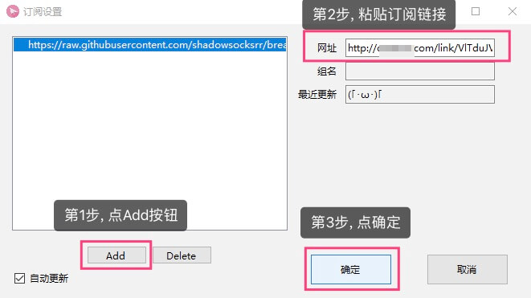
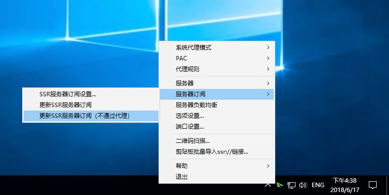
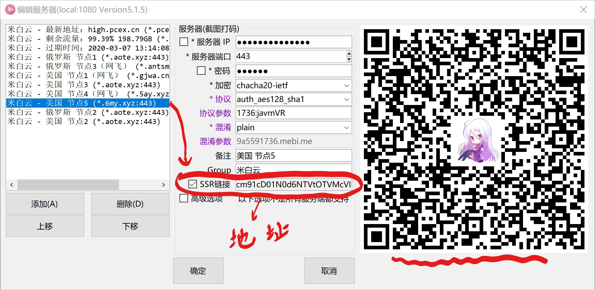

# 633-vpn

该`VPN`由于实验室经费支出，**仅限实验室内部人员使用**。

该`VPN`**仅限学术研究用途，不能用于娱乐**。

该`VPN`流量有限，**如果需要用VPN下载大文件（SIZE > 1GB），请先告知jiangyk**。


## Sign In

`VPN`的服务全在这个[**代理网站**](http://high.chtss.cn/)上，大家不懂的可以自行翻阅，以下是实验室的公共账号。

```java
username = 2693745210@qq.com

password = "用户名密码请询问jiangyk或xuchi"
```

（公共账号上请不要更改套餐!!）


## VPN-Software

用于代理服务的软件，目前实测可用的软件为ssr，即下面的链接。

（大家要是有什么更好的vpn软件，欢迎`fork`）

**SSR-Windows**

- [**Download SSR-Win**]( https://cowtransfer.com/s/d5bb428f9b4e49)
- 或者直接使用仓库里面的软件`ssr-win.rar`，解压即可，免安装

**SSR-Linux**

- [**Tutorials**](https://github.com/qingshuisiyuan/electron-ssr-backup)
- [**Download SSR-Linux**]( https://github.com/qingshuisiyuan/electron-ssr-backup/releases)
- [**Chrome插件 SwitchyOmega**](https://github.com/FelisCatus/SwitchyOmega/releases)


## Usage 
#### Windows下解决方案：更新服务器订阅

1、右键点击小飞机，选择 “服务器订阅” > “SSR服务器订阅设置“




2、再次右键点击小飞机，选择 “服务器订阅” > “更新SSR服务器订阅(不通过代理)





3、右键点击小飞机，选择 “服务器” > “米白云”，可随意切换节点。选择节点后即可正常使用。


#### Ubuntu下解决方案 ：直接导入ssr://地址

##### 在Ubuntu下翻墙需要设置Chrome的插件SwitchOmega


1.  [**下载Chrome插件 SwitchyOmega**](https://github.com/FelisCatus/SwitchyOmega/releases)
2.  把crx文件重命名为zip
3.  解压zip
4.  chrome搜索框搜索 chrome://extensions/
5.  打开Deveploper mode
6.  Load unpacked 选刚刚解压的文件夹
7.  设置浏览器右上角小圆圈的图标，模式切换为Auto switch

在linux下的ssr有时候会出现更新不了订阅地址的情况，这时候就需要我们手动导入ssr://地址

有两种方式：复制ssr地址（或者扫描二维码）。

在windows下左键点击小飞机，然后复制ssr地址（或者扫描二维码），再导入到linux-ssr软件下




